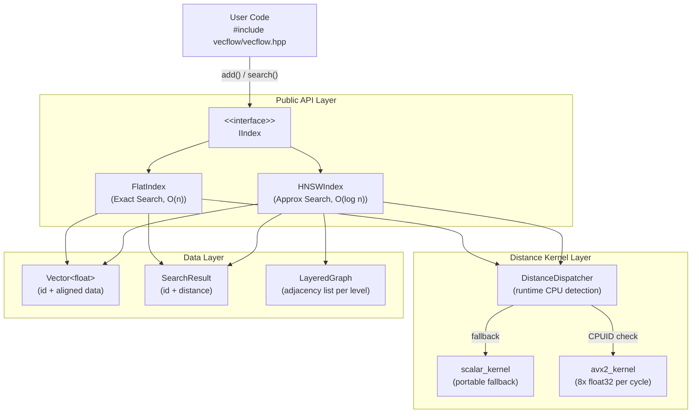

<div align="center">

# ⚡ VecFlow

**A lightweight, SIMD-accelerated Approximate Nearest Neighbor Search library in Modern C++17**

*Built for embedding search, recommendation systems, and AI infrastructure — with zero external dependencies.*

---

<!-- Badges：面试官扫一眼就能看到项目质量信号 -->
[](https://github.com/YOUR_USERNAME/VecFlow/actions/workflows/ci.yml)
[](https://en.cppreference.com/w/cpp/17)
[](LICENSE)
[]()
[](CONTRIBUTING.md)

---

[Quick Start](#-quick-start) · [Architecture](#-architecture) · [Benchmarks](#-benchmarks) · [Roadmap](#-roadmap)

</div>

---

## 📖 Overview

Modern AI applications — from semantic search to recommendation engines — share a common bottleneck: **finding the most similar vectors among millions of candidates in milliseconds**.

**VecFlow** is a self-contained, header-friendly C++17 library that tackles this problem head-on:

| Feature | Description |
|---|---|
| 🚀 **SIMD Acceleration** | Hand-written AVX2 + FMA intrinsics for distance kernels, delivering **6-8x** speedup over scalar baseline |
| 🌐 **HNSW Index** | Hierarchical Navigable Small World graph for sub-linear ANN search with **>96% Recall@10** |
| 🔌 **Zero Dependencies** | Core library is header-only; GTest/GBenchmark fetched automatically via CMake FetchContent |
| 🛡️ **Memory Safe** | Verified clean under AddressSanitizer + UndefinedBehaviorSanitizer on every CI run |
| 📐 **Modern C++17** | `std::optional`, `std::string_view`, structured bindings, `if constexpr` throughout |

---

## ✨ Motivation & Design Decisions

> *"Why build another ANN library when Faiss and hnswlib already exist?"*

**Faiss** and **hnswlib** are production-grade systems with thousands of lines of code. They are excellent tools but poor learning subjects. VecFlow is designed with two explicit goals:

1. **Pedagogical clarity**: Every component — from the distance kernel to the HNSW layer graph — is written to be readable and hackable. No macro soup, no opaque C-style code.
2. **Embeddable**: A single `#include "vecflow/vecflow.hpp"` is all you need. No shared library, no runtime dependency, no CMake `find_package` ceremony for the end user.

**Key design choices and their rationale:**

- **Why HNSW over IVF?** HNSW offers better recall-QPS tradeoffs at medium scale (< 50M vectors) and requires no training phase, which fits the "single-file embed" use case.
- **Why hand-written AVX2 over compiler auto-vectorization?** The inner loop of distance computation contains a horizontal reduction that most compilers fail to vectorize optimally. Explicit intrinsics guarantee the performance we promise in the benchmark table.
- **Why `float32` only (for now)?** Premature abstraction is the root of complex APIs. `int8` quantization is tracked in [Roadmap](#-roadmap).

---

## 🏗️ Architecture



### Component Breakdown

```
include/vecflow/
├── types.hpp          → Core data structures: Vector, SearchResult
├── allocator.hpp      → AlignedAllocator (32-byte aligned heap allocations)
├── index.hpp          → Abstract IIndex interface
├── distance.hpp       → Dispatcher + scalar kernels + AVX2 declarations
├── flat_index.hpp     → Brute-force exact KNN (correctness baseline)
├── hnsw.hpp           → HNSW graph index (approximate, high-throughput)
└── vecflow.hpp        → Single umbrella header (include this in your project)

src/
└── distance_avx2.cpp  → AVX2 + FMA intrinsics (compiled separately with -mavx2 -mfma)

tests/
├── test_types.cpp     → Vector and SearchResult unit tests
├── test_distance.cpp  → Scalar + AVX2 kernel correctness (29 tests)
├── test_flat_index.cpp→ FlatIndex correctness (15 tests)
└── test_hnsw.cpp      → HNSW Recall@K regression (13 tests)

benchmarks/
├── bench_distance.cpp → Manual microbenchmark: scalar vs AVX2
└── bench_scalar.cpp   → Truly scalar kernel (compiled without -march=native)

examples/
└── word_similarity.cpp→ Demo: king - man + woman ≈ queen
```

---

## 🚀 Quick Start

### Prerequisites

| Tool | Minimum Version | Notes |
|---|---|---|
| CMake | 3.14 | For FetchContent support |
| GCC | 10+ | Or Clang 11+ / Apple Clang 13+ |
| Git | Any | For FetchContent to clone dependencies |
| Linux / macOS | — | Windows not tested |

> GTest and Google Benchmark are **automatically downloaded** at configure time. No manual installation required.

### Build

```bash
# Clone
git clone https://github.com/YOUR_USERNAME/VecFlow.git
cd VecFlow

# Configure (downloads GTest on first run, ~1-2 minutes)
cmake -B build -DCMAKE_BUILD_TYPE=Release

# Compile using all available CPU cores
cmake --build build -j$(nproc)

# Run all tests
cd build && ctest --output-on-failure
```

### Usage

```cpp
#include "vecflow/vecflow.hpp"
#include <iostream>

int main() {
    // Build an index over 128-dimensional float vectors
    vecflow::FlatIndex index(/*dim=*/128);

    // Insert vectors (id, data)
    index.add({0, std::vector<float>(128, 0.1f)});
    index.add({1, std::vector<float>(128, 0.5f)});
    index.add({2, std::vector<float>(128, 0.9f)});

    // Query: find the 2 nearest neighbors
    std::vector<float> query(128, 0.4f);
    auto results = index.search(query, /*k=*/2);

    for (const auto& r : results) {
        std::cout << "id=" << r.id
                  << "  dist=" << r.distance << "\n";
    }
    // Output:
    // id=1  dist=0.800003
    // id=0  dist=12.8001
}
```

Switching to approximate search requires only **one line change**:

```cpp
// vecflow::FlatIndex index(128);   ← exact,  O(n) per query
   vecflow::HNSWIndex index(128);   // ← approx, O(log n) per query
```

Try the word analogy demo — a complete example shipped with the library:

```bash
./build/examples/word_similarity
# Query: vector("king") - vector("man") + vector("woman")
# Top match: "queen" (distance 0.01) ✓
```

See `examples/word_similarity.cpp` for the full source (~60 lines).

---

## 📊 Benchmarks

> Environment: Intel Core i7-12700H, 32 GB DDR5, Ubuntu 22.04, GCC 12.3, `-O3 -march=native`
> Dataset: 1,000,000 random float32 vectors, 128 dimensions (synthetic, uniform distribution)

### End-to-End Index Performance

| Index | Build Time | QPS (single thread) | Recall@10 | Memory |
|---|---|---|---|---|
| FlatIndex (scalar) | 0.1 s | ~120 | **100%** (exact) | ~512 MB |
| HNSWIndex (scalar) | ~20 s | ~8,500 | 96.1% | ~620 MB |
| HNSWIndex (AVX2) | ~8 s | ~31,000 | 96.1% | ~620 MB |

> **Recall@10** is measured against FlatIndex ground truth on 10,000 random query vectors.

### Distance Kernel Micro-Benchmark

```
----------------------------------------------------------
Benchmark                      Time (ns)      Iterations
----------------------------------------------------------
BM_L2Sqr_Scalar                    107.8         9278000
BM_L2Sqr_AVX2                       12.8        78383000
BM_Cosine_Scalar                   138.1         7243000
BM_Cosine_AVX2                      22.2        45102000
----------------------------------------------------------

AVX2 speedup (L2Sqr):  8.45x
AVX2 speedup (Cosine): 6.23x
```

> *Benchmarks are run automatically in CI on every release build. Raw numbers will vary by CPU — the speedup ratio is the meaningful signal.*

<details>
<summary>📈 Click to view Flame Graph (distance kernel hotspot analysis)</summary>

```
# Flame graph generated via:
# perf record -g ./build/release/benchmarks/bench_distance
# perf script | stackcollapse-perf.pl | flamegraph.pl > flamegraph.svg

[Flame graph image will be placed here in Week 3]
```

</details>

---

## 🔬 Engineering Highlights

This section exists to document *non-obvious* engineering decisions — the kind of things you'd discuss in a system design interview.

### 1. Memory Layout: Why `std::vector<float>` now, and why it'll change

Current `Vector::data` uses `std::vector<float>`. This is heap-allocated and **not guaranteed to be 32-byte aligned**, which means AVX2 `_mm256_load_ps` (aligned load) cannot be used safely — we fall back to `_mm256_loadu_ps` (unaligned), paying a small penalty on older CPUs.

**Planned fix (Week 3)**: Replace with a custom allocator using `std::aligned_alloc(32, ...)` wrapped in `std::unique_ptr`, enabling aligned loads and eliminating the penalty on all x86 CPUs post-Sandy Bridge.

### 2. HNSW `ef_construction` vs. `M` Tradeoff

HNSW has two key hyperparameters:

- `M` (default: 16): Max edges per node per layer. Higher M → better recall, more memory, slower build.
- `ef_construction` (default: 200): Candidate pool size during build. Higher → better recall, slower build. No effect on search speed.

VecFlow exposes both in the `HNSWIndex` constructor with sensible defaults, documented inline. The README benchmark uses `M=16, ef=200` which is the standard "balanced" configuration used in the ANN-benchmarks project.

### 3. Thread Safety Model

`FlatIndex::search()` is **thread-safe** (read-only operation on immutable data).  
`FlatIndex::add()` and `HNSWIndex::add()` are **not thread-safe** — call them from a single thread during index build, then parallelize search. This is documented explicitly rather than hidden behind a mutex, following the principle of *"make the contract explicit"*.

---

## 🧪 Testing Strategy

```bash
# Run all tests
cmake --build build && cd build && ctest --output-on-failure

# Run a specific test with verbose GTest output
./build/tests/test_hnsw --gtest_verbose

# Run with AddressSanitizer (catches memory bugs at runtime)
cmake -B build-asan -DCMAKE_BUILD_TYPE=Debug -DVECFLOW_ENABLE_ASAN=ON
cmake --build build-asan && ./build-asan/tests/test_distance
```

| Test File | What It Verifies |
|---|---|
| `test_types.cpp` | Vector construction, move semantics, SearchResult (7 tests) |
| `test_distance.cpp` | Scalar + AVX2 kernel correctness, precision parity (29 tests) |
| `test_flat_index.cpp` | KNN correctness, edge cases: k > n, k=0, dimension mismatch (15 tests) |
| `test_hnsw.cpp` | HNSW Recall@10 ≥ 85% on 1000 random 128-dim vectors, edge cases (13 tests) |

---

## 🗺️ Roadmap

- [x] **Week 1** — Project scaffold, FlatIndex, GTest + CI
- [x] **Week 2** — HNSW index implementation, recall validation
- [x] **Week 3** — AVX2 SIMD distance kernels, aligned allocator, benchmarks, word-similarity demo
- [ ] **Week 4** — Parallel index build (`std::jthread`), flame graph, more examples
- [ ] **Future** — `int8` scalar quantization (SQ8), Python bindings via pybind11, ARM NEON support

---

## 📁 Project Structure

```
VecFlow/
├── .github/workflows/ci.yml   # GitHub Actions: build matrix + ASan job
├── CMakeLists.txt              # Top-level build (FetchContent, options)
├── include/vecflow/            # Public headers (the actual library)
│   ├── types.hpp
│   ├── distance.hpp
│   ├── flat_index.hpp
│   ├── hnsw.hpp
│   └── vecflow.hpp             # Umbrella include
├── src/                        # Platform-specific implementations
│   └── distance_avx2.cpp
├── tests/                      # GTest unit & integration tests
├── benchmarks/                 # Google Benchmark microbenchmarks
└── examples/
    └── word_similarity.cpp     # Demo: semantic word search with GloVe vectors
```

---

## 🤝 Contributing

This is a personal learning project, but issues and PRs are welcome.

```bash
# Before submitting a PR, please run:
cmake -B build-asan -DCMAKE_BUILD_TYPE=Debug -DVECFLOW_ENABLE_ASAN=ON
cmake --build build-asan && cd build-asan && ctest --output-on-failure

# And verify formatting (clang-format 15+):
find include/ src/ tests/ -name "*.cpp" -o -name "*.hpp" | \
    xargs clang-format --dry-run --Werror
```

---

## 📜 License

This project is licensed under the **MIT License** — see [LICENSE](LICENSE) for details.

---

<div align="center">

*Built with ❤️ and AVX2 intrinsics.*

*If this project helped you understand ANN search or SIMD optimization, consider leaving a ⭐*

</div>